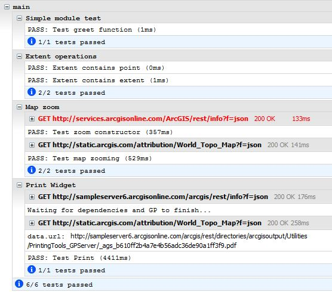

# intern-tutorial-esri-jsapi

This is a tutorial on using intern to unit/functional test your esri JavaScript API apps.

First off big props to Colin Snover over at sitepen for the intern-tutorial found [here](https://github.com/theintern/intern-tutorial). Colins tutorial was my starting point and helped me get the feel for intern and writing the tests themselves. I highly recommend you read his tutorial first, then come back here.

For a fast start running my example tests, follow these steps:

### Step 1:
* Clone or download this repo.
* We are going to run our tests with a browser so move or copy the tutorial to a web accessible folder. We will be using the browser test runner so intern needs to be served via a web server to avoid any cross domain errors.
* If you don't have node installed, [install](http://nodejs.org/) it.
* To run tests in selenium, read the notes in the seleneum section.

### Step 2:
* Install intern in the root of the project:

```bash
cd <path to the tutorial>
npm install intern
```
and if you wish (to support old IE, optional, see below):
```bash
npm install intern-geezer
```

* Thats it! your'e done!

### Step 3:
* Lets run the tests I provided in this tutorial, open a browser and point it here:

```bash
http://<path to the tutorial>/intern-tutorial-esri-jsapi/node_modules/intern/client.html?config=tests/intern
```
or for intern-geezer:
```bash
http://<path to the tutorial>/intern-tutorial-esri-jsapi/node_modules/intern-geezer/client.html?config=tests/intern
```

* you will need to have your console open as this is where the output from intern tests are displayed when using the browser runner (client.html). It should look something like this:



## Important notes for esri jsapi integration:

The key to making intern work with the esri jsapi is two fold:

1. Intern 1.3 will work with esrijs 3.6 and above (latest version tested is 3.8). If your app is looking to support old IE (8 and below) you will need to also use intern-geezer. Good news is the intern config will work for both, so you can install intern and intern-geezer side by side and use both by defining different test suites.

2. Defining the intern loader to work with the esri jsapi. Intern uses a local copy of dojo core. As such you need to tell it where to find the esri jsapi. Do this in your intern config file:

```javascript
loader: {
        // Packages that should be registered with the loader in each testing environment
        packages: [{
			name: 'tests',
			location: 'tests'
		},{
			name: 'app',
			location: 'app'
		}, {
			name: 'gis',
			location: 'gis'
		}, {
			name: 'esri',
			location: 'http://js.arcgis.com/3.8/js/esri'
		}, {
			name: 'dgrid',
			location: 'http://js.arcgis.com/3.8/js/dgrid'
		}, {
			name: 'put-selector',
			location: 'http://js.arcgis.com/3.8/js/put-selector'
		}, {
			name: 'xstyle',
			location: 'http://js.arcgis.com/3.8/js/xstyle'
		}, {
			name: 'dojo',
			location: 'http://js.arcgis.com/3.8/js/dojo/dojo'
		}, {
			name: 'dojox',
			location: 'http://js.arcgis.com/3.8/js/dojo/dojox'
		}, {
			name: 'dijit',
			location: 'http://js.arcgis.com/3.8/js/dojo/dijit'
		}]
	}
```

You also need to add the locations to your custom modules you want to load and test. In the above example 'app' and 'gis' is where we have some modules to test. Due to an quirk in the dojo loader, you will also need to register the 'tests' folder as a package, no biggie.

## Important notes for intern usage:

1. Intern-geezer only supports ```intern/chai!assert```. When using regular intern, you can take advantage of ```intern/chai!expect``` and ```intern/chai!should```.

## Notes for getting selenium server running
The simplest way to install selenium server is with homebrew. If you dont have [brew](http://brew.sh), install it first then:
```
$ brew update
$ brew doctor
$ brew install selenium-server-standalone chromedriver
```
to run selenium:
```
$ java -jar /usr/local/opt/selenium-server-standalone/libexec/selenium-server-standalone-2.40.0.jar -p 4444
```
Note: you may need to explor the `/usr/local/opt/selenium-server-standalone` folder for the jar location and name.

Then to run your tests:
```
$ node node_modules/intern/runner.js config=tests/intern.js
```
Notes:
You will want to have a seperate config for selenium vs sauce labs. In your config set:

1. turn "useSauceConnect" to false
2. set "capabilities" to whatever Selenium version you're running (the project linked above puts you on 2.40.0, etc)
3. update the environments section for browsers your local selenium actually supports. I used {browserName: 'chrome'} etc.

## Included tests

1. ```tests\hello.js ``` This test comes from Colins tutorial and is very simple, the hello world of intern.

2. ```tests\extent.js``` This test demonstrates using the esri Extent and Point classes from the api.

3. ```tests\map.js``` This test demonstrates the async testing method. This will be the most common test method as most apps need to wait for objects to load before they can be used. For example ```esri/map```.

4. ```tests\printWidget.js``` This test demonstrates how to use two objects that require waiting until their on load fires before testing. This also shows how to use the async method a little differently than ```map.js``` test. For more info on async tests read [here](https://github.com/theintern/intern/wiki/Writing-Tests#asynchronous-testing).

5. ```tests\functional\index.js``` This test comes from Colins tutorial is is the hello world for functional testing.

## Read the docs
Intern has docs located in the [wiki](https://github.com/theintern/intern/wiki) of the intern repo. Read them. While not comprehensive it does outline everything needed.

Chai doc can be found [here](http://chaijs.com/api/).

## Links
[lots of goodies](https://gist.github.com/dylans/94252f74f51e9b0102ac)
